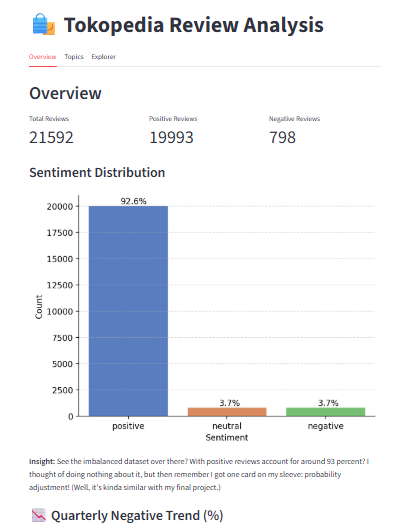
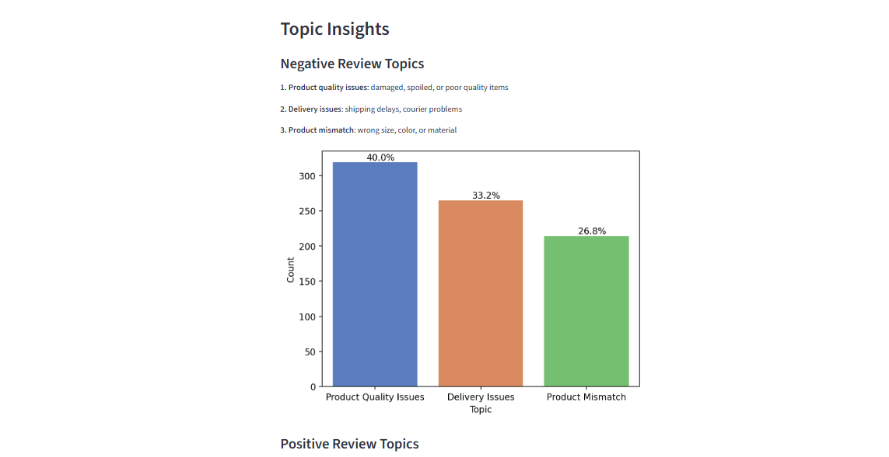

# Tokopedia Review Analysis (Sentiment + Topic Modeling)

- Github pages: https://irdazh.github.io/posts/customer-review/
- Live demo: https://customer-review.streamlit.app/

## Project Overview
This project analyzes customer reviews from Tokopedia to understand:
- Customer sentiment (positive, neutral, negative)
- Key issues and themes using topic modeling
- Patterns in review behavior

The final output is an interactive dashboard built with Streamlit. Nah, I failed to deploy it online. Well, pity of me. Any suggestions or corrections are really appreciated. Please, and thanks. 

## Dataset & Preprocessing

I used two dataset from Kaggle: 
1. [Tokopedia Product Reviews 2025](https://www.kaggle.com/datasets/salmanabdu/tokopedia-product-reviews-2025) dataset that contain around 65k samples of product reviews scraped from Tokopedia (in Indonesian of course); it contains 13 columns including review text, date, shop and product information, rating, and sentiment label. 
2. [kamus-alay](https://www.kaggle.com/datasets/oktasn/kamus-alay) dataset that contain informal Indonesian slang words to normalize text into standard Indonesian language. It wasn't 100 percent suitable for this case, but hey what's that horrific things over there??? 

### Data Cleaning
- Removed duplicate reviews
- Reduced excessive positive samples to mitigate imbalance (Actually, because i can't stand the training time. Yeah, it's not the best but whatever.)
- Final dataset still highly skewed (~92.6% positive)

### Text Preprocessing
Steps applied:
- Lowercasing
- Remove links, HTML tags, punctuation, newlines, words containing numbers, single characters, and extra spaces. 

Notes:
- No lemmatization (too computationally expensive -- as i said it earlier)
- No stopword removal (some stopwords carry meaning in context -- tho I'm not sure: like the word `tidak` or `enggak` that may imply the negative tone of a sentence)

### Additional Cleaning
- Removed empty text (0 words)
- Normalized slang words

## Exploratory Data Analysis

### Review Length
- 99% of reviews have < 60 words (cleaned one)
- Median length ≈ 9 words

### Most Common Words   
Including **stopwords** we have: 
- **Positive Reviews**: dan, cepat, sesuai, barang, bagus, pengiriman
- **Negative Reviews**: yang, tidak, di, enggak, sudah, dan, saya
- **Neutral Reviews**: yang, dan, di, tidak, ada, tapi, enggak

## Modeling (Sentiment Classification)

### Setup
- TF-IDF (5000 features)
- N-grams: (1,2)
- Train-test split: 80/20 (stratified)

### Models Used
- Naive Bayes (tuned with GridSearchCV)
- Logistic Regression
- HistGradientBoosting

## Evaluation Insights
- Accuracy is misleading due to class imbalance
- Macro F1-score used as main metric

### Results

**Better to add F1-score comparison in chart**
- Logistic Regression ≈ Naive Bayes
- HistGradientBoosting performs slightly better on minority classes
- However, training time is ~20x longer

### Final Choice    
Logistic Regression (best trade-off between performance and efficiency)

## Probability Adjustment (Improvement)

Two approaches tested:

### Case 1
Adjust using class prior `p/prior`: 
- Improves recall (negative & neutral)
- Reduces positive class performance
- No overall F1 improvement

### Case 2 (Chosen)
Adjust using `p / ((prior + 0.5) / 2)`:  
- Improves recall & F1 (negative & neutral)
- Maintains strong performance on positive class
- Overall F1 increased from **0.51 → 0.59**

## Topic Modeling

### Method
- LDA (Latent Dirichlet Allocation)
- TF-IDF vectorizer:
  - max_df = 0.95
  - min_df = 5
  - ngram (1,2)
- Indonesian + custom + domain stopwords

### Approach
- 1 vectorizer
- Separate LDA models for:
  - Positive reviews
  - Negative reviews

### Topics Identified
1. Product Quality
2. Delivery & Packaging
3. Product Match / Expectation

## Dashboard Features

### 1. Overview
- Total reviews
- Sentiment distribution
- Quarterly negative trend
- Review length distribution

### 2. Topic Insights
- Distribution of topics
- Key themes:
  - Product quality
  - Delivery & packaging
  - Product match / expectation

### 3. Review Explorer
- User input text
- Sentiment prediction (with adjusted probability)
- Topic inference

### Dashboard Preview

For a full demo (tho kinda fail), follow [this link!](https://customer-review.streamlit.app/)

 

## Tech Stack
- Python
- Scikit-learn
- Pandas / NumPy
- Matplotlib, Seaborn
- Streamlit

## Key Takeaways
- Handling class imbalance is critical in real-world datasets
- Accuracy alone is not a reliable metric
- Simple models (Logistic Regression) can outperform complex ones when optimized properly
- Topic modeling provides additional business insights beyond sentiment classification

## Limitations
- Dataset is highly imbalanced (~92% positive)
- LDA topics are not always stable for short text
- No lemmatization may reduce text normalization quality

## Future Work
- Try BERTopic for better topic coherence (tho for smaller dataset, i don't think it'll work)
- Improve preprocessing with faster lemmatization
- Deploy model as API (what is API?)
- Enhance UI/UX of dashboard (ew*)

